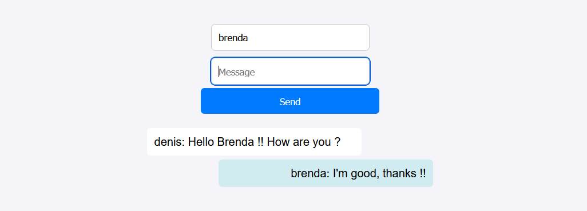
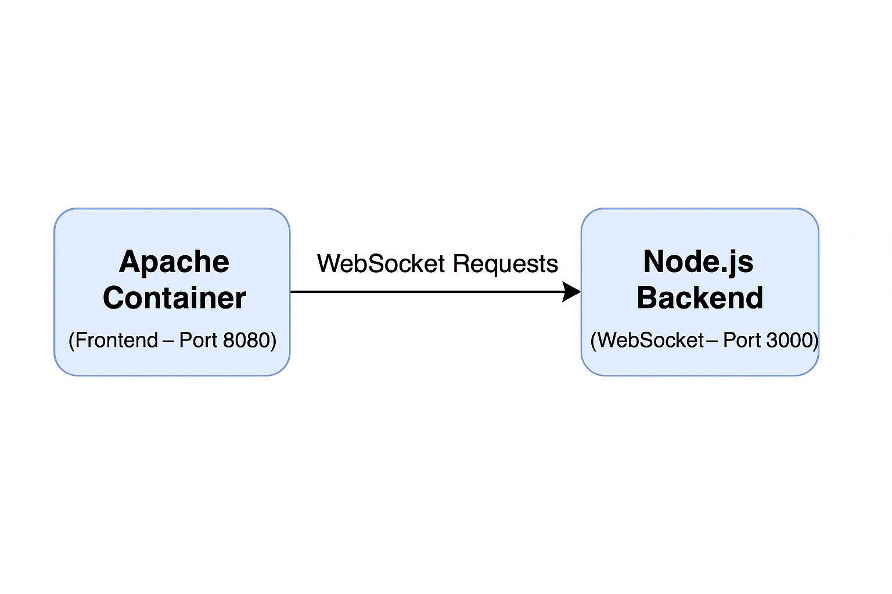

# Chat App – Apache Frontend with Node.js Backend

This project was created with the main goal of **learning and applying containerization using Docker** to integrate a real-time application with separated frontend and backend environments.

It combines a **frontend served by Apache HTTP Server** and a **Node.js backend** powered by **Express** and **Socket.IO** for WebSocket-based communication. Docker containers isolate and manage both services, ensuring consistency, portability, and ease of deployment.

  

## 📦 Technologies Used

- **Apache HTTP Server (httpd)** – Serves the frontend
- **Node.js + Express** – REST and WebSocket backend
- **Socket.IO** – Enables real-time bi-directional communication
- **Docker + Docker Compose** – Service containerization and orchestration

## ⚙️ Architecture Overview

  

## 🚀 Getting Started

1. Clone the repository
2. Run `docker-compose up --build`
3. Access `http://localhost:8080` in your browser
   
## 🛠️ Future Improvements

This is the **first version** of the project. Future updates may include:

- Automated testing (Jest, Supertest)
- Authentication and user management
- UI/UX enhancements
- Deployment to cloud platforms (AWS, GCP)
- CI/CD setup

---

Built with ❤️ by **Brenda Gouveia** as a practical learning project focused on containerization and multi-service architecture.
